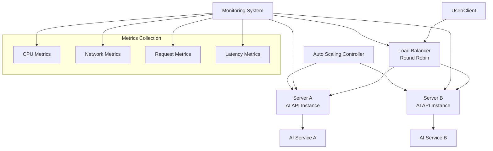
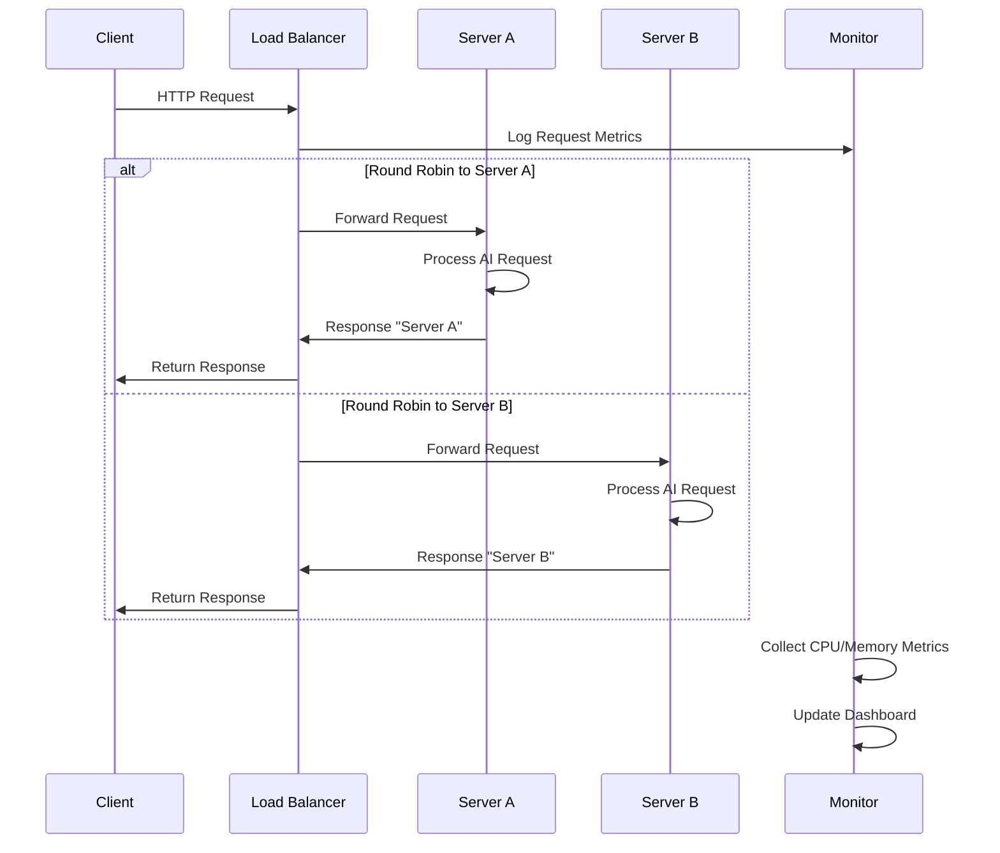
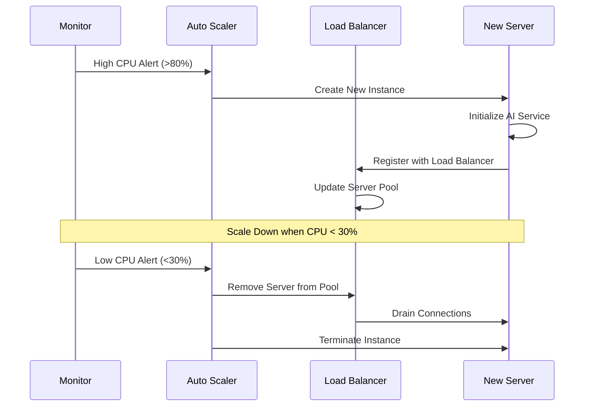

# Design Document: Scalable AI API System

## Overview

Hệ thống AI API có khả năng mở rộng được thiết kế để xử lý nhiều yêu cầu đồng thời thông qua kiến trúc load balancing với 2 server instances. Hệ thống sử dụng Round Robin load balancing để phân phối request đều giữa các server, đảm bảo high availability và khả năng scale horizontal. Mỗi server instance chạy AI API độc lập và trả về response khác biệt để dễ dàng theo dõi và test load balancing.

## Architecture



## Sequence Diagrams

### Main Request Flow



### Auto Scaling Flow



## Components and Interfaces

### Component 1: Load Balancer

**Purpose**: Phân phối request đều giữa các AI server instances sử dụng Round Robin algorithm

**Interface**:
```pascal
INTERFACE LoadBalancer
  PROCEDURE routeRequest(request: HTTPRequest): HTTPResponse
  PROCEDURE addServer(server: ServerInstance): Boolean
  PROCEDURE removeServer(serverId: String): Boolean
  PROCEDURE getHealthStatus(): HealthStatus
  PROCEDURE getCurrentServerPool(): List<ServerInstance>
END INTERFACE
```

**Responsibilities**:
- Thực hiện Round Robin load balancing
- Health check các server instances
- Quản lý server pool động
- Logging và metrics collection

### Component 2: AI API Server

**Purpose**: Xử lý AI requests và trả về responses với server identification

**Interface**:
```pascal
INTERFACE AIAPIServer
  PROCEDURE processAIRequest(request: AIRequest): AIResponse
  PROCEDURE getServerInfo(): ServerInfo
  PROCEDURE getHealthMetrics(): HealthMetrics
  PROCEDURE shutdown(): Boolean
END INTERFACE
```

**Responsibilities**:
- Xử lý AI inference requests
- Trả về server-specific responses
- Báo cáo health metrics
- Graceful shutdown handling

### Component 3: Monitoring System

**Purpose**: Thu thập và phân tích metrics từ toàn bộ hệ thống

**Interface**:
```pascal
INTERFACE MonitoringSystem
  PROCEDURE collectMetrics(source: String): Metrics
  PROCEDURE analyzePerformance(): PerformanceReport
  PROCEDURE triggerAlert(condition: AlertCondition): Boolean
  PROCEDURE generateReport(): SystemReport
END INTERFACE
```

**Responsibilities**:
- Thu thập CPU, memory, network metrics
- Phân tích performance trends
- Trigger auto scaling alerts
- Tạo monitoring dashboard

### Component 4: Auto Scaling Controller

**Purpose**: Tự động scale up/down dựa trên metrics và thresholds

**Interface**:
```pascal
INTERFACE AutoScalingController
  PROCEDURE evaluateScalingNeed(): ScalingDecision
  PROCEDURE scaleUp(targetCount: Integer): Boolean
  PROCEDURE scaleDown(targetCount: Integer): Boolean
  PROCEDURE setScalingPolicy(policy: ScalingPolicy): Boolean
END INTERFACE
```

**Responsibilities**:
- Monitor scaling triggers
- Tạo/xóa server instances
- Cập nhật load balancer configuration
- Maintain minimum/maximum instance counts

## Data Models

### Model 1: ServerInstance

```pascal
STRUCTURE ServerInstance
  id: String
  ipAddress: String
  port: Integer
  status: ServerStatus
  healthScore: Float
  lastHealthCheck: Timestamp
  cpuUsage: Float
  memoryUsage: Float
  requestCount: Integer
  responseTime: Float
END STRUCTURE
```

**Validation Rules**:
- id phải unique trong server pool
- ipAddress phải là valid IP format
- port phải trong range 1-65535
- healthScore phải trong range 0.0-1.0

### Model 2: AIRequest

```pascal
STRUCTURE AIRequest
  requestId: String
  clientId: String
  prompt: String
  parameters: Map<String, Any>
  timestamp: Timestamp
  priority: RequestPriority
END STRUCTURE
```

**Validation Rules**:
- requestId phải unique
- prompt không được empty
- timestamp phải valid

### Model 3: LoadBalancerMetrics

```pascal
STRUCTURE LoadBalancerMetrics
  totalRequests: Integer
  requestsPerSecond: Float
  averageResponseTime: Float
  errorRate: Float
  activeConnections: Integer
  serverDistribution: Map<String, Integer>
  timestamp: Timestamp
END STRUCTURE
```

**Validation Rules**:
- Tất cả numeric fields phải >= 0
- errorRate phải trong range 0.0-1.0

### Model 4: ScalingPolicy

```pascal
STRUCTURE ScalingPolicy
  minInstances: Integer
  maxInstances: Integer
  scaleUpThreshold: Float
  scaleDownThreshold: Float
  cooldownPeriod: Integer
  metricsWindow: Integer
END STRUCTURE
```

**Validation Rules**:
- minInstances >= 1
- maxInstances >= minInstances
- scaleUpThreshold > scaleDownThreshold

## Algorithmic Pseudocode

### Main Load Balancing Algorithm

```pascal
ALGORITHM roundRobinLoadBalance(request)
INPUT: request of type HTTPRequest
OUTPUT: response of type HTTPResponse

BEGIN
  ASSERT serverPool.size() > 0
  
  // Get next server using round robin
  currentIndex ← (lastServerIndex + 1) MOD serverPool.size()
  
  // Find healthy server starting from current index
  attempts ← 0
  WHILE attempts < serverPool.size() DO
    server ← serverPool[currentIndex]
    
    IF server.status = HEALTHY THEN
      lastServerIndex ← currentIndex
      
      // Forward request to selected server
      response ← forwardRequest(server, request)
      
      // Update metrics
      updateMetrics(server, request, response)
      
      ASSERT response IS NOT NULL
      RETURN response
    END IF
    
    currentIndex ← (currentIndex + 1) MOD serverPool.size()
    attempts ← attempts + 1
  END WHILE
  
  // No healthy servers available
  RETURN createErrorResponse("No healthy servers available")
END
```

**Preconditions**:
- serverPool contains at least one server
- request is valid HTTP request
- Load balancer is initialized

**Postconditions**:
- Returns valid HTTP response
- lastServerIndex is updated to selected server
- Metrics are recorded for the request
- If no healthy servers, returns error response

**Loop Invariants**:
- attempts <= serverPool.size()
- currentIndex is valid array index
- All checked servers before currentIndex are unhealthy

### Auto Scaling Decision Algorithm

```pascal
ALGORITHM evaluateScalingDecision()
INPUT: None (uses current system metrics)
OUTPUT: decision of type ScalingDecision

BEGIN
  metrics ← collectCurrentMetrics()
  avgCPU ← calculateAverageCPU(metrics, metricsWindow)
  avgMemory ← calculateAverageMemory(metrics, metricsWindow)
  requestRate ← calculateRequestRate(metrics, metricsWindow)
  
  currentInstances ← serverPool.size()
  
  // Check scale up conditions
  IF (avgCPU > scaleUpThreshold OR 
      avgMemory > scaleUpThreshold OR
      requestRate > maxRequestsPerInstance * currentInstances) AND
     currentInstances < maxInstances AND
     timeSinceLastScale() > cooldownPeriod THEN
    
    targetInstances ← MIN(currentInstances + 1, maxInstances)
    RETURN ScalingDecision(SCALE_UP, targetInstances)
  END IF
  
  // Check scale down conditions  
  IF (avgCPU < scaleDownThreshold AND 
      avgMemory < scaleDownThreshold AND
      requestRate < maxRequestsPerInstance * (currentInstances - 1)) AND
     currentInstances > minInstances AND
     timeSinceLastScale() > cooldownPeriod THEN
    
    targetInstances ← MAX(currentInstances - 1, minInstances)
    RETURN ScalingDecision(SCALE_DOWN, targetInstances)
  END IF
  
  RETURN ScalingDecision(NO_CHANGE, currentInstances)
END
```

**Preconditions**:
- Metrics collection system is operational
- Scaling policy is configured
- At least minInstances servers are running

**Postconditions**:
- Returns valid scaling decision
- Decision respects min/max instance limits
- Cooldown period is enforced

**Loop Invariants**:
- N/A (no loops in this algorithm)

### Health Check Algorithm

```pascal
ALGORITHM performHealthCheck(server)
INPUT: server of type ServerInstance
OUTPUT: healthStatus of type HealthStatus

BEGIN
  ASSERT server IS NOT NULL
  
  startTime ← getCurrentTime()
  
  TRY
    // Send health check request
    response ← sendHTTPRequest(server.ipAddress, server.port, "/health")
    
    responseTime ← getCurrentTime() - startTime
    
    IF response.statusCode = 200 AND responseTime < maxResponseTime THEN
      server.healthScore ← calculateHealthScore(responseTime, server.cpuUsage)
      server.lastHealthCheck ← getCurrentTime()
      server.status ← HEALTHY
      RETURN HealthStatus(HEALTHY, responseTime, "OK")
    ELSE
      server.status ← UNHEALTHY
      RETURN HealthStatus(UNHEALTHY, responseTime, "Slow response or error")
    END IF
    
  CATCH NetworkException e
    server.status ← UNHEALTHY
    RETURN HealthStatus(UNHEALTHY, -1, e.message)
  END TRY
END
```

**Preconditions**:
- server object is valid and not null
- Network connectivity exists
- Health check endpoint is configured

**Postconditions**:
- server.status is updated
- server.lastHealthCheck is updated
- Returns valid health status
- Health score is calculated for healthy servers

**Loop Invariants**:
- N/A (no loops in this algorithm)

## Key Functions with Formal Specifications

### Function 1: forwardRequest()

```pascal
FUNCTION forwardRequest(server: ServerInstance, request: HTTPRequest): HTTPResponse
```

**Preconditions:**
- server is not null and has valid IP/port
- server.status = HEALTHY
- request is valid HTTP request
- Network connection is available

**Postconditions:**
- Returns valid HTTP response or error response
- Request metrics are recorded
- Server response time is updated
- If network error occurs, server status may be updated to UNHEALTHY

**Loop Invariants:** N/A

### Function 2: updateMetrics()

```pascal
FUNCTION updateMetrics(server: ServerInstance, request: HTTPRequest, response: HTTPResponse): Void
```

**Preconditions:**
- server, request, and response are not null
- response contains valid timing information
- Metrics storage system is available

**Postconditions:**
- Server metrics are updated (request count, response time)
- Global load balancer metrics are updated
- Metrics are persisted to monitoring system
- No side effects on input parameters

**Loop Invariants:** N/A

### Function 3: calculateHealthScore()

```pascal
FUNCTION calculateHealthScore(responseTime: Float, cpuUsage: Float): Float
```

**Preconditions:**
- responseTime >= 0
- cpuUsage is between 0.0 and 100.0
- Both parameters represent valid measurements

**Postconditions:**
- Returns health score between 0.0 and 1.0
- Higher score indicates better health
- Score considers both response time and CPU usage
- Formula: score = (1.0 - responseTime/maxResponseTime) * (1.0 - cpuUsage/100.0)

**Loop Invariants:** N/A

## Example Usage

```pascal
// Example 1: Initialize Load Balancer
SEQUENCE
  loadBalancer ← createLoadBalancer()
  serverA ← createServerInstance("192.168.1.10", 8080, "Server A")
  serverB ← createServerInstance("192.168.1.11", 8080, "Server B")
  
  loadBalancer.addServer(serverA)
  loadBalancer.addServer(serverB)
  
  loadBalancer.start()
END SEQUENCE

// Example 2: Handle Client Request
SEQUENCE
  request ← receiveHTTPRequest()
  
  IF request.path = "/api/ai" THEN
    response ← loadBalancer.routeRequest(request)
    sendResponse(response)
  ELSE
    sendErrorResponse(404, "Not Found")
  END IF
END SEQUENCE

// Example 3: Auto Scaling Process
SEQUENCE
  WHILE systemRunning DO
    decision ← autoScaler.evaluateScalingNeed()
    
    IF decision.action = SCALE_UP THEN
      newServer ← createNewServerInstance()
      loadBalancer.addServer(newServer)
      DISPLAY "Scaled up to " + decision.targetInstances + " instances"
    ELSE IF decision.action = SCALE_DOWN THEN
      serverToRemove ← selectServerForRemoval()
      loadBalancer.removeServer(serverToRemove.id)
      terminateServerInstance(serverToRemove)
      DISPLAY "Scaled down to " + decision.targetInstances + " instances"
    END IF
    
    WAIT scalingCheckInterval
  END WHILE
END SEQUENCE
```

## Correctness Properties

*A property is a characteristic or behavior that should hold true across all valid executions of a system-essentially, a formal statement about what the system should do. Properties serve as the bridge between human-readable specifications and machine-verifiable correctness guarantees.*

### Property 1: Round Robin Request Distribution

*For any* sequence of requests sent to the Load_Balancer with all servers healthy, the requests should be distributed in strict round robin order to available servers

**Validates: Requirements 1.1**

### Property 2: Load Distribution Fairness

*For any* set of requests processed by the Load_Balancer, the difference in request count between any two healthy servers should never exceed 1

**Validates: Requirements 1.2**

### Property 3: Health-Aware Routing

*For any* request sent to the Load_Balancer, if there exists at least one healthy server, the request should be routed only to healthy servers and never to unhealthy servers

**Validates: Requirements 1.3, 2.5**

### Property 4: Dynamic Server Pool Management

*For any* server added to the server pool, the next request should be eligible to be routed to that server according to round robin order

**Validates: Requirements 1.5**

### Property 5: Server Response Identification

*For any* request processed by an AI_Server, the response should contain clear identification of which server processed the request

**Validates: Requirements 2.2, 2.3, 6.2**

### Property 6: Health Status Consistency

*For any* server that responds to health check with HTTP 200 within timeout, the Health_Checker should mark it as healthy, and for any server that fails to respond or returns error, it should be marked as unhealthy

**Validates: Requirements 3.2, 3.3**

### Property 7: Health Transition Logging

*For any* server status change from healthy to unhealthy or vice versa, the Monitoring_System should log the transition with timestamp and server identification

**Validates: Requirements 3.4**

### Property 8: Consecutive Failure Handling

*For any* server that fails health checks consecutively more than the configured threshold, the Load_Balancer should exclude it from active rotation

**Validates: Requirements 3.5**

### Property 9: Metrics Collection Completeness

*For any* request processed through the system, the Monitoring_System should collect and record corresponding metrics including request count, response time, and server identification

**Validates: Requirements 4.2, 4.3**

### Property 10: Threshold-Based State Classification

*For any* CPU usage value, the Monitoring_System should correctly classify it as idle (< 30%), normal (30-80%), or high load (> 80%) and log appropriate events for threshold crossings

**Validates: Requirements 4.4, 4.5**

### Property 11: Auto Scaling Bounds Invariant

*For any* scaling operation performed by the Auto_Scaler, the resulting number of server instances should always be between the configured minimum (2) and maximum (10) bounds inclusive

**Validates: Requirements 5.3, 5.4**

### Property 12: Scaling Integration

*For any* new server instance created during scale-up operations, the Auto_Scaler should automatically register it with the Load_Balancer and it should become available for request routing

**Validates: Requirements 5.5**

### Property 13: Request Processing Completeness

*For any* valid AI request received by an AI_Server, it should return a response within the configured timeout period and include proper server identification

**Validates: Requirements 6.1, 6.2**

### Property 14: Request Correlation Preservation

*For any* request that includes a correlation ID, the AI_Server should preserve and return the same correlation ID in the response

**Validates: Requirements 6.3**

### Property 15: Error Response Consistency

*For any* request that fails during processing, the AI_Server should return an appropriate HTTP error code with a descriptive error message

**Validates: Requirements 6.4**

### Property 16: Concurrent Request Safety

*For any* set of concurrent requests processed by the system, each response should correspond exactly to its originating request without data corruption or response mixing

**Validates: Requirements 6.5**

### Property 17: Performance Report Completeness

*For any* performance report generated by the Monitoring_System, it should include all required metrics: throughput, latency, error rates, and server distribution statistics

**Validates: Requirements 7.1**

### Property 18: Load Balancer Efficiency Tracking

*For any* monitoring period, the system should calculate and report load balancer efficiency metrics and request distribution fairness scores

**Validates: Requirements 7.4**

### Property 19: Performance Degradation Alerting

*For any* system performance metric that falls below configured acceptable thresholds, the Monitoring_System should generate appropriate alerts

**Validates: Requirements 7.5**

### Property 20: Network Retry Behavior

*For any* network failure encountered during request processing, the system should implement retry logic with exponential backoff according to configured parameters

**Validates: Requirements 8.2**

### Property 21: Request Timeout Enforcement

*For any* request that exceeds the configured timeout period (30 seconds), the Load_Balancer should terminate the request and return a timeout error

**Validates: Requirements 8.4**

### Property 22: Network Error Logging

*For any* network error that occurs during system operation, the system should log the error with sufficient detail including timestamp, error type, and affected components

**Validates: Requirements 8.5**

### Property 23: Configuration Loading Validation

*For any* configuration provided through environment variables or configuration files, the system should successfully load and apply valid configurations, and reject invalid configurations with descriptive error messages

**Validates: Requirements 9.1, 9.5**

### Property 24: Dynamic Server Management

*For any* server addition or removal operation performed during system runtime, the Load_Balancer should update its server pool without interrupting ongoing request processing

**Validates: Requirements 9.2**

### Property 25: Configurable Scaling Thresholds

*For any* scaling decision made by the Auto_Scaler, it should use the currently configured threshold values and make decisions consistent with those thresholds

**Validates: Requirements 9.4**

## Error Handling

### Error Scenario 1: All Servers Unhealthy

**Condition**: Tất cả servers trong pool có status = UNHEALTHY
**Response**: Load balancer trả về HTTP 503 Service Unavailable
**Recovery**: 
- Tiếp tục health checks để detect khi servers recover
- Auto scaler tạo new instances nếu configured
- Alert administrators về system outage

### Error Scenario 2: Network Partition

**Condition**: Load balancer mất kết nối với một hoặc nhiều servers
**Response**: 
- Mark affected servers as UNHEALTHY
- Route traffic chỉ đến healthy servers
- Log network errors cho troubleshooting

**Recovery**:
- Health checks sẽ detect khi network connectivity restored
- Automatically re-add servers to pool khi healthy
- Update monitoring dashboard

### Error Scenario 3: Auto Scaling Failure

**Condition**: Không thể tạo new server instances khi scale up
**Response**:
- Log scaling failure với detailed error message
- Continue với current server pool
- Alert administrators về scaling issue

**Recovery**:
- Retry scaling operation sau cooldown period
- Check resource quotas và permissions
- Fallback to manual scaling nếu cần

### Error Scenario 4: High CPU/Memory Usage

**Condition**: Server CPU hoặc memory usage > 90%
**Response**:
- Trigger immediate scale up nếu possible
- Reduce server health score
- Increase monitoring frequency

**Recovery**:
- Scale up để distribute load
- Monitor for performance improvement
- Investigate root cause nếu persistent

## Testing Strategy

### Unit Testing Approach

**Core Components Testing**:
- Test Round Robin algorithm với different server pool sizes
- Verify health check logic với various response scenarios  
- Test auto scaling decision logic với different metric combinations
- Mock external dependencies (network calls, server instances)

**Key Test Cases**:
- Load balancer với 1, 2, 5, 10 servers
- Health check timeouts và network failures
- Scaling triggers với edge case metrics
- Error handling cho all failure scenarios

**Coverage Goals**: 90% code coverage cho core algorithms

### Property-Based Testing Approach

**Property Test Library**: fast-check (JavaScript) hoặc Hypothesis (Python)

**Properties to Test**:
1. **Round Robin Fairness**: Generate random request sequences, verify distribution fairness
2. **Scaling Bounds**: Generate random metrics, verify scaling decisions respect limits
3. **Health Check Consistency**: Generate server states, verify health logic consistency
4. **Load Balancer Invariants**: Generate server pool changes, verify system remains stable

**Test Data Generation**:
- Random server configurations (IP, port, health status)
- Random request patterns (burst, steady, mixed)
- Random metric values (CPU, memory, response times)
- Random failure scenarios (network, server crashes)

### Integration Testing Approach

**End-to-End Testing**:
- Deploy actual load balancer với real server instances
- Send concurrent requests và verify responses
- Test auto scaling với real resource usage
- Verify monitoring data accuracy

**Performance Testing**:
- Load testing với increasing concurrent users
- Measure response times và throughput
- Test system behavior under stress
- Verify graceful degradation

**Chaos Engineering**:
- Randomly kill server instances
- Simulate network partitions
- Test recovery mechanisms
- Verify system resilience

## Performance Considerations

**Latency Optimization**:
- Keep-alive connections giữa load balancer và servers
- Connection pooling để reduce setup overhead
- Async request processing để improve throughput
- Response caching cho frequently requested data

**Throughput Scaling**:
- Horizontal scaling với auto scaling policies
- Load balancer performance tuning (worker processes, connection limits)
- Server instance optimization (CPU, memory allocation)
- Network bandwidth monitoring và optimization

**Resource Efficiency**:
- Efficient health check intervals (balance accuracy vs overhead)
- Metrics collection optimization (sampling, aggregation)
- Memory usage monitoring để prevent leaks
- CPU usage optimization trong load balancing logic

**Bottleneck Analysis**:
- Load balancer có thể become bottleneck với very high traffic
- Network bandwidth giữa components
- Server instance processing capacity
- Database connections nếu AI models require persistent storage

## Security Considerations

**Network Security**:
- TLS/SSL encryption cho all communications
- Network segmentation giữa load balancer và servers
- Firewall rules để restrict access
- VPN hoặc private networks cho internal communication

**Authentication & Authorization**:
- API key authentication cho client requests
- IAM roles với least privilege principle
- Service-to-service authentication
- Rate limiting để prevent abuse

**Data Protection**:
- Input validation cho all API requests
- Sanitization của AI prompts và responses
- Audit logging cho security events
- Data encryption at rest nếu storing user data

**Infrastructure Security**:
- Regular security updates cho all components
- Container security scanning nếu using containers
- Secrets management cho API keys và credentials
- Monitoring cho suspicious activities

## Dependencies

**Core Infrastructure**:
- Load Balancer: HAProxy, NGINX, hoặc cloud load balancer (AWS ALB, GCP Load Balancer)
- Container Platform: Docker + Kubernetes hoặc cloud container services
- Monitoring: Prometheus + Grafana hoặc cloud monitoring (CloudWatch, Stackdriver)
- Auto Scaling: Kubernetes HPA hoặc cloud auto scaling services

**AI/ML Dependencies**:
- AI Model Serving: TensorFlow Serving, TorchServe, hoặc cloud AI services
- Model Storage: S3, GCS, hoặc distributed file system
- GPU Support: CUDA drivers nếu using GPU instances
- Model Versioning: MLflow hoặc similar model management tools

**Development & Deployment**:
- Programming Language: Python (FastAPI), Node.js (Express), hoặc Go
- Database: Redis cho caching, PostgreSQL cho metadata nếu cần
- Message Queue: RabbitMQ hoặc cloud messaging services nếu async processing
- CI/CD: GitHub Actions, GitLab CI, hoặc cloud build services

**Monitoring & Observability**:
- Metrics Collection: Prometheus, StatsD, hoặc cloud metrics APIs
- Logging: ELK Stack (Elasticsearch, Logstash, Kibana) hoặc cloud logging
- Tracing: Jaeger hoặc Zipkin cho distributed tracing
- Alerting: PagerDuty, Slack integration, hoặc email notifications